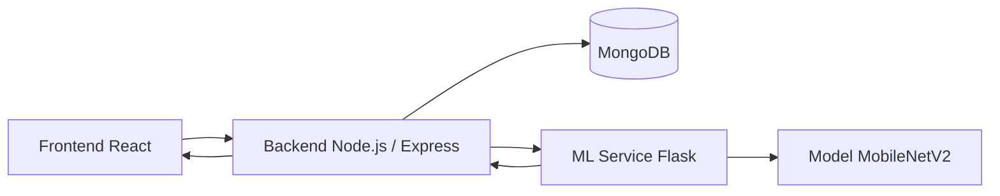

# 🌳 Hệ thống quản lý canh tác và dự đoán bệnh trên cây có múi

Đây là đồ án tốt nghiệp xây dựng một hệ thống web hỗ trợ quản lý vườn cây có múi, ghi nhận hoạt động canh tác, theo dõi chi phí và dự đoán bệnh trên lá cây bằng AI.

Hệ thống được thiết kế theo mô hình 4 lớp rõ ràng: **Frontend → Backend → Database → ML**. Người dùng thao tác trên giao diện web, backend xử lý nghiệp vụ và xác thực, MongoDB lưu dữ liệu, còn dịch vụ ML chịu trách nhiệm huấn luyện và dự đoán bệnh từ ảnh lá cây.

## 1. Giới thiệu dự án

Mục tiêu của dự án là số hóa quá trình quản lý vườn cây có múi và hỗ trợ người dùng phát hiện sớm bệnh trên lá cây. Hệ thống phù hợp cho nông hộ, kỹ thuật viên hoặc cán bộ quản lý nông nghiệp cần theo dõi thông tin canh tác và ra quyết định nhanh hơn dựa trên dữ liệu.

## 2. Mục tiêu hệ thống

- Quản lý thông tin vườn cây, nhật ký canh tác, chi phí và mùa vụ.
- Hỗ trợ nhận diện bệnh cây có múi từ ảnh lá cây.
- Cho phép admin quản lý dữ liệu bệnh và theo dõi kết quả huấn luyện mô hình.
- Cung cấp giao diện web thân thiện, dễ dùng trên cả máy tính và điện thoại.
- Tách biệt rõ frontend, backend, database và AI để dễ bảo trì và mở rộng.

## 3. Kiến trúc hệ thống



### Luồng xử lý chính

1. Người dùng đăng nhập trên frontend.
2. Frontend gửi request đến backend qua REST API.
3. Backend xác thực JWT, kiểm tra phân quyền và truy vấn MongoDB.
4. Khi người dùng tải ảnh lá cây lên, backend chuyển ảnh sang dịch vụ ML.
5. ML xử lý ảnh, dự đoán bệnh và trả kết quả về backend.
6. Backend lưu lịch sử dự đoán và trả kết quả cho frontend.
7. Admin xem kết quả train, precision, recall, F1 và bật/tắt chế độ bảo trì từ trang quản trị.

## 4. Công nghệ sử dụng

### Frontend

- React 18
- Vite
- TailwindCSS
- React Router
- Axios
- React Hook Form
- React Hot Toast

### Backend

- Node.js
- Express
- MongoDB
- Mongoose
- JSON Web Token
- Multer
- Axios

### Machine Learning

- Python
- TensorFlow / Keras
- MobileNetV2
- Flask
- scikit-learn
- NumPy
- Pillow

## 5. Hướng dẫn cài đặt nhanh

### Yêu cầu môi trường

- Node.js 18+
- Python 3.10+
- MongoDB

### Cài đặt backend

```bash
cd backend
npm install
```

### Cài đặt frontend

```bash
cd frontend
npm install
```

### Cài đặt ML

```bash
cd ml
python -m venv venv
venv\Scripts\activate
pip install -r requirements.txt
```

### Chạy toàn hệ thống

Mở 3 terminal riêng:

```bash
# Terminal 1 - Backend
cd backend
npm run dev
```

```bash
# Terminal 2 - Frontend
cd frontend
npm run dev
```

```bash
# Terminal 3 - ML
cd ml
python train.py
python app.py
```

## 6. Cấu trúc thư mục

```text
project-root/
├── backend/
│   ├── src/
│   │   ├── controllers/
│   │   ├── models/
│   │   ├── routes/
│   │   └── app.js
│   ├── scripts/
│   └── README.md
├── frontend/
│   ├── src/
│   │   ├── components/
│   │   ├── pages/
│   │   ├── services/
│   │   └── App.jsx
│   └── README.md
├── ml/
│   ├── datasets/
│   ├── app.py
│   ├── train.py
│   └── README.md
└── README.md
```

## 7. Phân quyền người dùng

### User

- Đăng nhập và quản lý thông tin cá nhân.
- Xem vườn cây, nhật ký, chi phí, mùa vụ.
- Tải ảnh lên để dự đoán bệnh.
- Xem lịch sử dự đoán và thông tin bệnh.

### Admin

- Toàn quyền quản lý dữ liệu hệ thống.
- Thêm, sửa, xóa bệnh và dữ liệu liên quan.
- Xem trạng thái huấn luyện mô hình.
- Bật/tắt chế độ bảo trì.
- Theo dõi tiến trình retrain và chỉ số đánh giá mô hình.

## 8. Tính năng chính

- Đăng ký, đăng nhập, xác thực JWT.
- Quản lý vườn cây, nhật ký canh tác, chi phí và mùa vụ.
- Quản lý danh sách bệnh trên cây có múi.
- Dự đoán bệnh từ ảnh lá cây bằng AI.
- Hiển thị Top-k kết quả dự đoán.
- Trang admin xem precision, recall, F1, loss và kết quả train gần nhất.
- Chế độ bảo trì toàn hệ thống.
- Giao diện responsive, phù hợp cho desktop và mobile.

## 9. Screenshot

> Thay các hình ảnh bên dưới bằng ảnh chụp màn hình thực tế của dự án.

- Trang đăng nhập: ``
- Trang dashboard: ``
- Trang quản lý vườn: ``
- Trang dự đoán bệnh: ``
- Trang ML Training: ``

## 10. Thông tin sinh viên / đồ án

- **Tên đồ án:** Hệ thống quản lý canh tác và dự đoán bệnh trên cây có múi
- **Học phần:** Khóa luận tốt nghiệp
- **Sinh viên thực hiện:** Nguyễn Phúc An Quân
- **Ngành:** [Điền ngành học của bạn]
- **Giảng viên hướng dẫn:** [Điền họ tên giảng viên]
- **Trường:** [Điền tên trường]

## Ghi chú triển khai

- Backend chạy ở `http://localhost:3000`
- Frontend chạy ở `http://localhost:5173`
- ML API chạy ở `http://localhost:5000`
- Khi thêm dữ liệu bệnh mới, cần retrain lại model để cập nhật kết quả dự đoán
