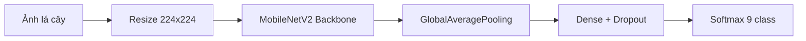

# Machine Learning - Dự đoán bệnh trên cây có múi

Thư mục `ml/` chứa toàn bộ phần huấn luyện và dự đoán bệnh từ ảnh lá cây. Mô hình được xây dựng theo hướng transfer learning với MobileNetV2, sau đó fine-tune cho 9 lớp bệnh cây có múi.

## 1. Giới thiệu model

Mô hình ML nhận ảnh lá cây đầu vào, tiền xử lý ảnh, trích xuất đặc trưng bằng MobileNetV2 và đưa ra xác suất cho từng class bệnh. Kết quả dự đoán được backend sử dụng để hiển thị lên frontend và lưu lịch sử dự đoán.

## 2. Dataset

Tập dữ liệu train được gộp từ 3 nguồn chính:

- `Orange Leaf Disease Dataset`: 4804 ảnh mẫu
- `Citrus Leaf Disease Image`: 607 ảnh mẫu
- `Suriname Citrus Fruit Tree Leaves Pests Diseases`: 426 ảnh mẫu

Tổng số ảnh mẫu: **5837**.

### 9 loại bệnh / class

- `canker` - Bệnh loét
- `melanose` - Bệnh nấm melanose
- `greening` - Vàng lá gân xanh
- `black_spot` - Đốm đen
- `greasy_spot` - Đốm dầu
- `leafminer` - Sâu vẽ bùa
- `deficiency` - Thiếu dinh dưỡng
- `healthy` - Lá khỏe mạnh
- `multiple` - Nhiều bệnh

## 3. Công nghệ sử dụng

- Python
- TensorFlow / Keras
- MobileNetV2
- Flask
- scikit-learn
- NumPy
- Pillow
- OpenCV

## 4. Kiến trúc model



### Pipeline xử lý

1. Ảnh được resize về `224x224`.
2. Ảnh được chuẩn hóa trước khi đưa vào model.
3. MobileNetV2 đóng vai trò backbone trích xuất đặc trưng.
4. Lớp phân loại cuối dùng softmax để trả xác suất từng class.
5. Flask API nhận request từ backend và trả kết quả dự đoán.

## 5. Training

### Chạy huấn luyện

```bash
cd ml
python train.py
```

### Chạy API dự đoán

```bash
cd ml
python app.py
```

### Tham số train tham khảo

- Input size: `224x224x3`
- Batch size: `32`
- Epochs: tùy cấu hình trong `train.py`
- Loss: `categorical_crossentropy`
- Optimizer: `Adam`
- Data augmentation: xoay, lật, zoom, dịch chuyển

### Kết quả đầu ra sau train

- `model.h5` - model đã huấn luyện
- `disease_labels.json` - mapping label/class
- `training_report.json` - báo cáo train và đánh giá

## 6. Cách chạy model

### Cài đặt môi trường

```bash
cd ml
python -m venv venv
venv\Scripts\activate
pip install -r requirements.txt
```

### Huấn luyện model

```bash
python train.py
```

### Khởi động API

```bash
python app.py
```

ML service mặc định chạy tại `http://localhost:5000`.

## 7. API dự đoán

### `GET /health`

Kiểm tra trạng thái service.

**Response mẫu:**

```json
{
  "success": true,
  "status": "ok"
}
```

### `GET /api/diseases`

Trả danh sách bệnh và tên class.

### `POST /api/predict`

Nhận ảnh và trả kết quả dự đoán.

**Request:**

```bash
curl -X POST http://localhost:5000/api/predict \
  -F "image=@image.jpg"
```

**Response mẫu:**

```json
{
  "success": true,
  "data": {
    "disease_en": "canker",
    "disease_vi": "Bệnh loét",
    "confidence": 92.45,
    "top_3": [
      {
        "disease_en": "canker",
        "disease_vi": "Bệnh loét",
        "confidence": 92.45
      },
      {
        "disease_en": "black_spot",
        "disease_vi": "Đốm đen",
        "confidence": 5.23
      }
    ]
  }
}
```

## 8. Danh sách file quan trọng

- `train.py` - train model và xuất báo cáo
- `app.py` - Flask API dự đoán
- `datasets/` - dữ liệu ảnh đầu vào
- `organized_dataset/` - dữ liệu sau khi chuẩn hóa theo class
- `model.h5` - model đã train
- `disease_labels.json` - ánh xạ nhãn
- `training_report.json` - kết quả train gần nhất

## 9. Ghi chú triển khai

- Nếu thêm ảnh hoặc thêm class mới, cần chạy lại `python train.py`.
- Backend đọc `training_report.json` để hiển thị kết quả train trên admin.
- Nếu chỉ muốn dùng dự đoán, chỉ cần chạy `python app.py` sau khi đã có `model.h5`.
